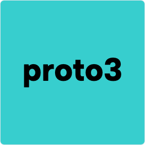
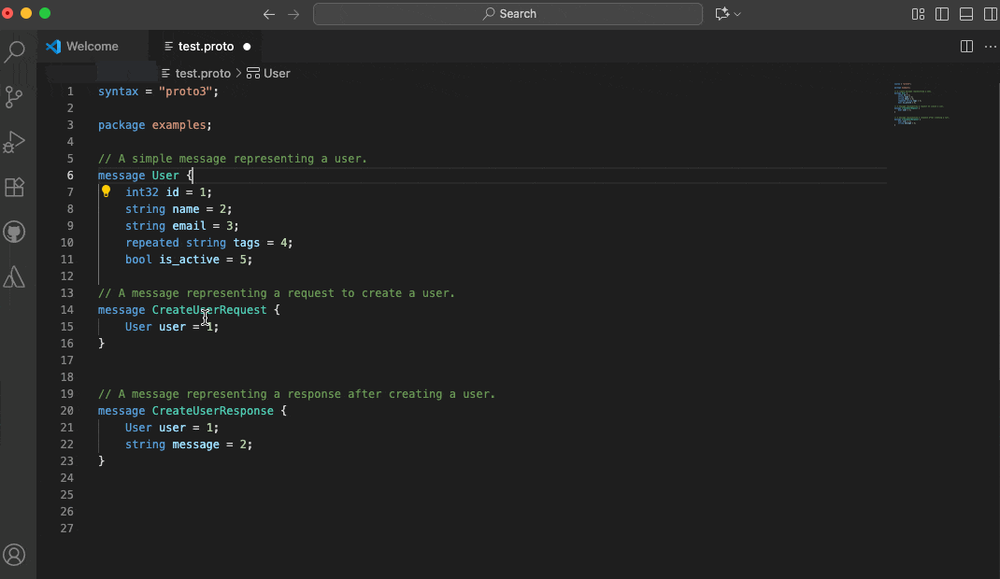

<table>
<tr>
<td></td>
<td><h1>Protobuf Language Support for VS Code (Protols)</h1></td>
</tr>
</table>

[](https://marketplace.visualstudio.com/items?itemName=ianandhum.protobuf-support)

Easily work with [Protocol Buffers](https://developers.google.com/protocol-buffers) (`.proto` files) in Visual Studio Code. This extension provides rich language support for proto3, including syntax highlighting, code navigation, completions, diagnostics, and helpful snippets.

Powered by the [protols](https://github.com/coder3101/protols) language server.


## Features


- **Syntax Highlighting** for `.proto` files
- **Snippets** for common proto3 constructs
- **Go to Definition** and **Find References**
- **Basic Code Completions**
- **Diagnostics** for errors and warnings


### Demo

Below is an example of the extension in action:




## Installation

1. **From Marketplace:**
   - [Install from VS Code Marketplace](https://marketplace.visualstudio.com/items?itemName=ianandhum.protobuf-support)
2. **Manual:**
   - Download the latest `.vsix` from [Releases](https://github.com/ianandhum/vscode-protobuf-support/releases) and install via `Extensions: Install from VSIX...` in VS Code.

## Getting Started

Open any `.proto` file to activate the extension. Syntax highlighting and snippets work out of the box.

On first use, the extension will prompt to install the `protols` language server automatically.


## Configuration

- If `protols` is not installed in your system `PATH`, set the path manually in your VS Code `settings.json`:

  ```json
  {
    "protobuf-support.protols.path": "/path/to/protols"
  }
  ```

- To install `protols` manually (requires [Rust](https://www.rust-lang.org/tools/install)):

  ```sh
  cargo install protols
  ```

## Requirements

- [VS Code](https://code.visualstudio.com/)
- [protols](https://github.com/coder3101/protols) language server (auto-installed or manual)


## Attribution

- TextMate grammars and basic snippets are sourced from [zxh0/vscode-proto3](https://github.com/zxh0/vscode-proto3)
- Language features powered by [coder3101/protols](https://github.com/coder3101/protols)


## Contributing

Contributions, issues, and feature requests are welcome! Feel free to open an [issue](https://github.com/ianandhum/vscode-protobuf-support/issues) or submit a pull request.


## License

This project is licensed under the [MIT License](LICENSE).


## Support

For questions or help, open an issue on [GitHub](https://github.com/ianandhum/vscode-protobuf-support/issues).
